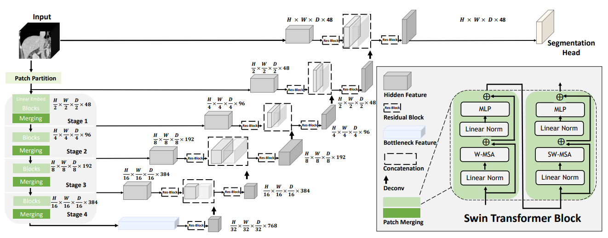

# Model Overview

This repository contains the code for enhancing the SwinUNETR model using a Shape Stream. Swin UNETR [1,2] is the state-of-the-art on Medical Segmentation. For a reference to the SwinUNETR model and training instructions, please see <a href="https://github.com/Project-MONAI/research-contributions/tree/main/SwinUNETR/BTCV" > this repository </a>

# Citation

```
@inproceedings{tang2022self,
  title={Self-supervised pre-training of swin transformers for 3d medical image analysis},
  author={Tang, Yucheng and Yang, Dong and Li, Wenqi and Roth, Holger R and Landman, Bennett and Xu, Daguang and Nath, Vishwesh and Hatamizadeh, Ali},
  booktitle={Proceedings of the IEEE/CVF Conference on Computer Vision and Pattern Recognition},
  pages={20730--20740},
  year={2022}
}

@article{hatamizadeh2022swin,
  title={Swin UNETR: Swin Transformers for Semantic Segmentation of Brain Tumors in MRI Images},
  author={Hatamizadeh, Ali and Nath, Vishwesh and Tang, Yucheng and Yang, Dong and Roth, Holger and Xu, Daguang},
  journal={arXiv preprint arXiv:2201.01266},
  year={2022}
}
```

# References
[1]: Tang, Y., Yang, D., Li, W., Roth, H.R., Landman, B., Xu, D., Nath, V. and Hatamizadeh, A., 2022. Self-supervised pre-training of swin transformers for 3d medical image analysis. In Proceedings of the IEEE/CVF Conference on Computer Vision and Pattern Recognition (pp. 20730-20740).

[2]: Hatamizadeh, A., Nath, V., Tang, Y., Yang, D., Roth, H. and Xu, D., 2022. Swin UNETR: Swin Transformers for Semantic Segmentation of Brain Tumors in MRI Images. arXiv preprint arXiv:2201.01266.
